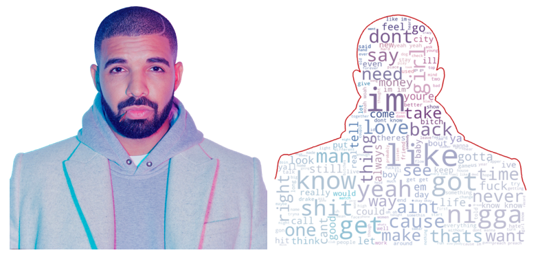
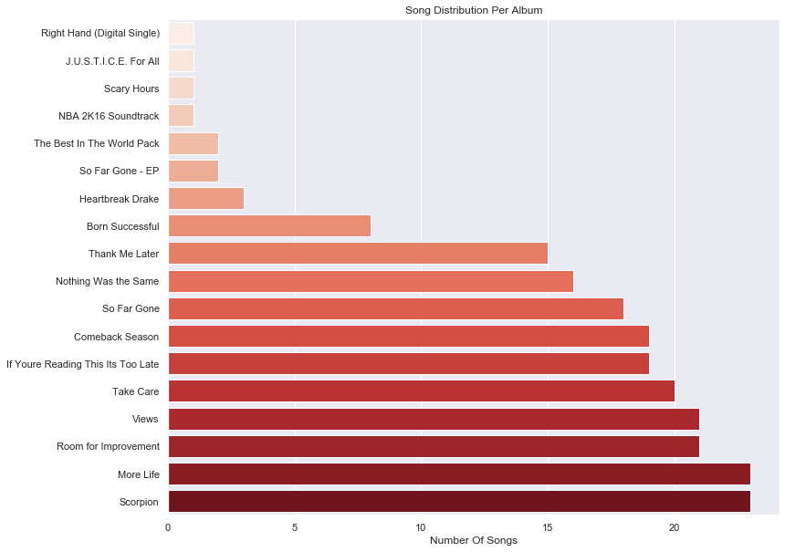
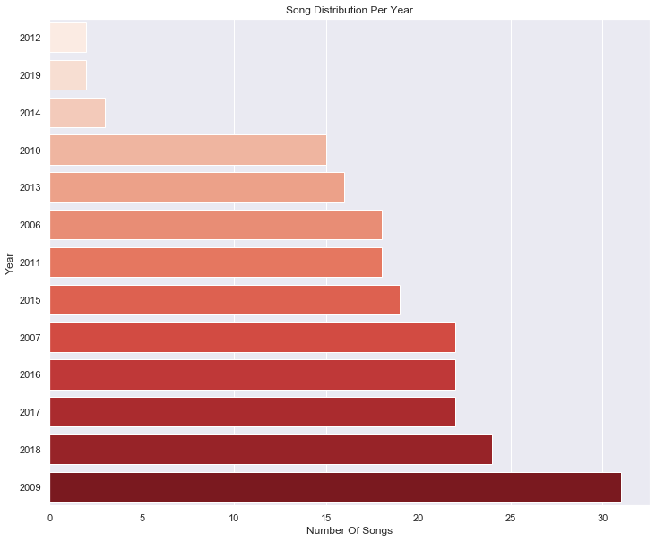
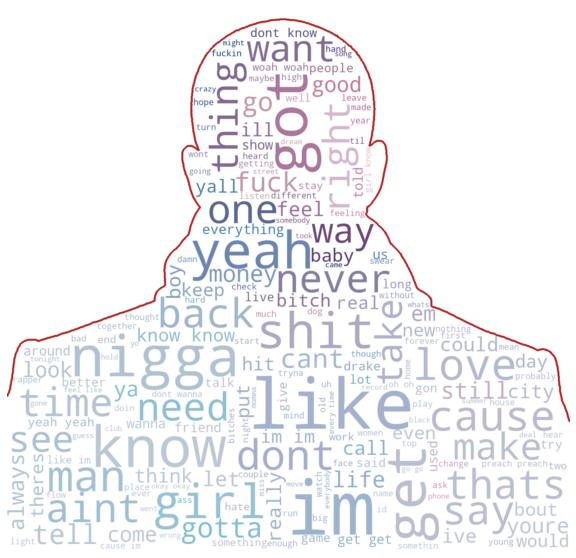
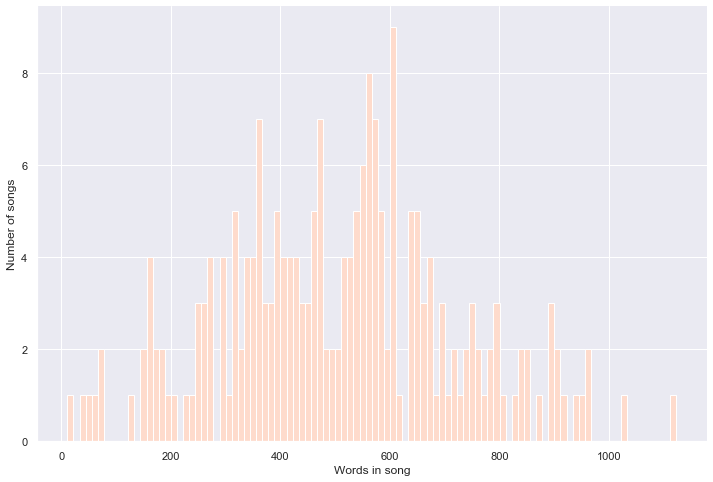
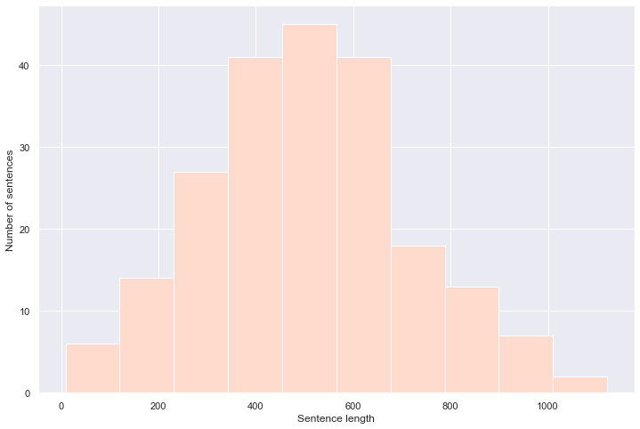
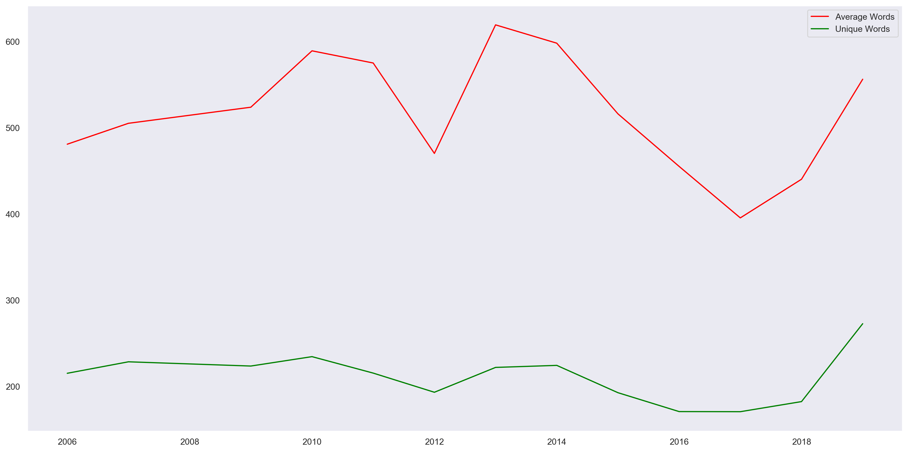
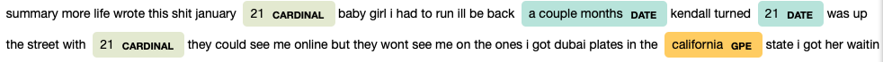
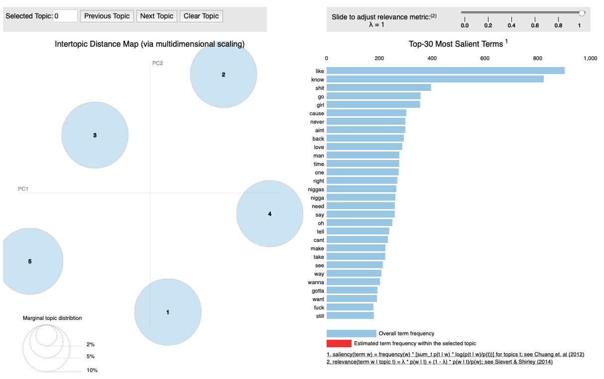

# Drake Analysis: A Deeper Look Into The Discography Of Canada's Rap King

---

# Introduction



Hip-Hop is my favorite music genre of all time, and Drake is an artist I've listened to for years. Many text mining analyses have been performed on rap lyrics, but I haven't seen enough works that actually dig deeper into one specific artist's discography (or in this case, Drake's discography). In this project, I will apply various Natural Language Process techniques to analyze Drake's lyrics.

As I have been doing a lot of practices on classical Machine Learning, or Deep Learning applied to images (Computer Vision), I don't have nearly as much experience working with text data. This project is my introduction to the world of Natural Language Processing, and text analysis in general.

## What I Have Learned From This Project

In this project, I have practiced:

* Scraped 500 songs info with lyrics from genius.com
* Performed data wrangling and exploratory data analysis with Matplotlib and Seaborn
* Applied various NLP techniques: word embedding, bag-of-words, tokenization with NLTK, NER with SpaCy
* Topic modeling with LDA, dimensionality reduction with t-SNE, interactive topic visualization with pyLDAvis

# Building the Dataset

Drake is one of the biggest, if not the biggest, rap artists in the world. Thanks to Drake's popularity, his work is very expansive and well-documented, with five official studio albums and six mixtapes. To obtain the lyrics of all Drake's songs, I scraped the data from [Genius](https://genius.com) using the wonderful [Genius API](https://github.com/johnwmillr/LyricsGenius).

## Data Cleaning

Despite having such easy-to-use API assisting the scraping process, cleaning the data was no easy task. Out of over **500** songs on Genius, there were around **300** tracks that are either duplicates, Live version, diss tracks, or the like, and they were all filtered from the dataset. The lyrics were not clean data either, as there were a lot of noise, redundant characters, and typos. 

To see codes for the whole data preprocessing process, you can check this [notebook](https://github.com/andreduong/drakenerator/blob/master/lyrics-scraping.ipynb). [NBViewer Link](https://nbviewer.jupyter.org/github/andreduong/drakenerator/blob/master/data-preprocessing.ipynb).

# Career Overview

First, let's load data from the csv file:


```python
# load the data
data = pd.read_csv('lyrics.csv')
data.head(10)
```

<table border="1" class="dataframe">
  <thead>
    <tr style="text-align: right;">
      <th></th>
      <th>name</th>
      <th>album</th>
      <th>year</th>
      <th>lyrics</th>
    </tr>
  </thead>
  <tbody>
    <tr>
      <th>0</th>
      <td>Right to Left</td>
      <td>Born Successful</td>
      <td>2009</td>
      <td>blue green jewels with the supreme fuel and l...</td>
    </tr>
    <tr>
      <th>1</th>
      <td>Forever (Born Successful)</td>
      <td>Born Successful</td>
      <td>2009</td>
      <td>it may not mean nothing to yall but understan...</td>
    </tr>
    <tr>
      <th>2</th>
      <td>The Winner</td>
      <td>Born Successful</td>
      <td>2009</td>
      <td>i m performing tonight you know that shit gon...</td>
    </tr>
    <tr>
      <th>3</th>
      <td>I Do This</td>
      <td>Born Successful</td>
      <td>2009</td>
      <td>uh shits all good the deal got signed and my ...</td>
    </tr>
    <tr>
      <th>4</th>
      <td>Fallen</td>
      <td>Born Successful</td>
      <td>2009</td>
      <td>yeah its drake kc we was just walking just sm...</td>
    </tr>
    <tr>
      <th>5</th>
      <td>Do It Now</td>
      <td>Born Successful</td>
      <td>2009</td>
      <td>uh yeah alright uh well alright yeah well alr...</td>
    </tr>
    <tr>
      <th>6</th>
      <td>The Search</td>
      <td>Born Successful</td>
      <td>2009</td>
      <td>they say we killin em all all all all hip hop...</td>
    </tr>
    <tr>
      <th>7</th>
      <td>Juice</td>
      <td>Born Successful</td>
      <td>2009</td>
      <td>boi 1da drizzy yall dont really like me i can...</td>
    </tr>
    <tr>
      <th>8</th>
      <td>Man of the Year</td>
      <td>Comeback Season</td>
      <td>2007</td>
      <td>damn i done walked in here looking like the m...</td>
    </tr>
    <tr>
      <th>9</th>
      <td>Give Ya</td>
      <td>Comeback Season</td>
      <td>2007</td>
      <td>check look and i aint tryna get to know nobod...</td>
    </tr>
  </tbody>
</table>
</div>

```python
data.tail(10)
```

<table border="1" class="dataframe">
  <thead>
    <tr style="text-align: right;">
      <th></th>
      <th>name</th>
      <th>album</th>
      <th>year</th>
      <th>lyrics</th>
    </tr>
  </thead>
  <tbody>
    <tr>
      <th>204</th>
      <td>Pop Style</td>
      <td>Views</td>
      <td>2016</td>
      <td>this sound like some forty three oh one shit ...</td>
    </tr>
    <tr>
      <th>205</th>
      <td>Grammys</td>
      <td>Views</td>
      <td>2016</td>
      <td>yeah yeah yeah yeah jheeze yeah right look lo...</td>
    </tr>
    <tr>
      <th>206</th>
      <td>Redemption</td>
      <td>Views</td>
      <td>2016</td>
      <td>yeah i get it i get it yeah why would i say a...</td>
    </tr>
    <tr>
      <th>207</th>
      <td>Too Good</td>
      <td>Views</td>
      <td>2016</td>
      <td>oh yeah yeah yeah oh yeah yeah yeah yeah look...</td>
    </tr>
    <tr>
      <th>208</th>
      <td>Controlla</td>
      <td>Views</td>
      <td>2016</td>
      <td>right my yiy just changed you just buzzed the...</td>
    </tr>
    <tr>
      <th>209</th>
      <td>Views [Trailer]</td>
      <td>Views</td>
      <td>2016</td>
      <td>the 6 raptors diamond key new ride old ride ba...</td>
    </tr>
    <tr>
      <th>210</th>
      <td>Summers Over Interlude</td>
      <td>Views</td>
      <td>2016</td>
      <td>ooh baby yeah days in the sun and nights in t...</td>
    </tr>
    <tr>
      <th>211</th>
      <td>Views</td>
      <td>Views</td>
      <td>2016</td>
      <td>question is will i ever leave you the answer ...</td>
    </tr>
    <tr>
      <th>212</th>
      <td>With You</td>
      <td>Views</td>
      <td>2016</td>
      <td>its about us right now girl where you going i...</td>
    </tr>
    <tr>
      <th>213</th>
      <td>One Dance</td>
      <td>Views</td>
      <td>2016</td>
      <td>baby i like your style grips on your waist fr...</td>
    </tr>
  </tbody>
</table>
</div>

# From "Comeback Season" to "The Best In The World Pack"

Drake has a relatively huge, rich discography. According to this dataset, for 13 years of his music career, Drake has had 18 albums/mixtapes in total.



# Drake In The Streaming Era: Quantity > All?

In this streaming era, artists tend to put as many tracks as possible in one album to boost their streaming numbers. This is true for Drake as well: his more recent albums (More Life, Scorpion, Views) all have higher numbers of songs comparing to his older ones with the exception of 2009, when he released three tapes in one year.



# WordCloud



# Words Per Song



# Sentence Length



# Adding Word Counts & Unique Word Counts

<table border="1" class="dataframe">
  <thead>
    <tr style="text-align: right;">
      <th></th>
      <th>name</th>
      <th>album</th>
      <th>year</th>
      <th>lyrics</th>
      <th>tokens</th>
      <th>Word Counts</th>
      <th>Unique Word Counts</th>
    </tr>
  </thead>
  <tbody>
    <tr>
      <th>106</th>
      <td>Make Things Right</td>
      <td>Room for Improvement</td>
      <td>2006</td>
      <td>look if you a girl with the aspirations of be...</td>
      <td>[look, if, you, a, girl, with, the, aspiration...</td>
      <td>456</td>
      <td>223</td>
    </tr>
    <tr>
      <th>109</th>
      <td>Intro (Room For Improvement)</td>
      <td>Room for Improvement</td>
      <td>2006</td>
      <td>yo whats going on this is drake and ima let y...</td>
      <td>[yo, whats, going, on, this, is, drake, and, i...</td>
      <td>184</td>
      <td>92</td>
    </tr>
    <tr>
      <th>108</th>
      <td>Try Harder</td>
      <td>Room for Improvement</td>
      <td>2006</td>
      <td>sometimes i feel like lohan and hilary duff a...</td>
      <td>[sometimes, i, feel, like, lohan, and, hilary,...</td>
      <td>395</td>
      <td>198</td>
    </tr>
    <tr>
      <th>107</th>
      <td>Thrill Is Gone</td>
      <td>Room for Improvement</td>
      <td>2006</td>
      <td>loves lost loves gone love lost love is gone l...</td>
      <td>[loves, lost, loves, gone, love, lost, love, i...</td>
      <td>579</td>
      <td>260</td>
    </tr>
    <tr>
      <th>105</th>
      <td>Video Girl</td>
      <td>Room for Improvement</td>
      <td>2006</td>
      <td>uh yea get in my slick rick mode na mean im a...</td>
      <td>[uh, yea, get, in, my, slick, rick, mode, na, ...</td>
      <td>782</td>
      <td>338</td>
    </tr>
    <tr>
      <th>104</th>
      <td>All This Love</td>
      <td>Room for Improvement</td>
      <td>2006</td>
      <td>southern smoke this another one from your boy ...</td>
      <td>[southern, smoke, this, another, one, from, yo...</td>
      <td>458</td>
      <td>172</td>
    </tr>
    <tr>
      <th>103</th>
      <td>Pianist Hands</td>
      <td>Room for Improvement</td>
      <td>2006</td>
      <td>thank you ms graham for coming today you look ...</td>
      <td>[thank, you, ms, graham, for, coming, today, y...</td>
      <td>161</td>
      <td>101</td>
    </tr>
    <tr>
      <th>110</th>
      <td>Drakes Voice Mail Box #2</td>
      <td>Room for Improvement</td>
      <td>2006</td>
      <td>what up this kim damn i ve been trying to get...</td>
      <td>[what, up, this, kim, damn, i, ve, been, tryin...</td>
      <td>43</td>
      <td>28</td>
    </tr>
    <tr>
      <th>102</th>
      <td>Drakes Voice Mail Box #1</td>
      <td>Room for Improvement</td>
      <td>2006</td>
      <td>the man drake puts it the fuck down he s doin...</td>
      <td>[the, man, drake, puts, it, the, fuck, down, h...</td>
      <td>162</td>
      <td>85</td>
    </tr>
    <tr>
      <th>100</th>
      <td>Do What You Do</td>
      <td>Room for Improvement</td>
      <td>2006</td>
      <td>stance on lean leg up on the wall my niggas c...</td>
      <td>[stance, on, lean, leg, up, on, the, wall, my,...</td>
      <td>829</td>
      <td>262</td>
    </tr>
  </tbody>
</table>
</div>

# Is Drake Becoming Less Lyrical? Actually, No.



From the graph above, we can see:

* "Take Care", Drake's 2011-2012 album that is widely recognized as his best albums, is actually one of his less lyrical ones.
* Lyrics wise, Drake was at his worst in 2016-2017, when he made a breakthrough commercially with the mega hit "Hotline Bling" that helped him top the charts from all around the world and become the biggest artist across all genres at that time. It's a dilemma for most Hip-Hop artists: you make catchy, commercial friendly songs that will top the charts and make you a lot of money/fame, in exchange for your artistry.
* However, Drake is making a comeback. Since 2018, both of his lyrical statistics has been skyrocketing, and they're going as strong as ever. As of now, Drake is currently at his peak lyrically and he shows no signs of stopping.

# Named Entity Recognition With SpaCy

Named entity recognition (NER) is probably the first step towards information extraction that seeks to locate and classify named entities in text into pre-defined categories such as the names of persons, organizations, locations, expressions of times, quantities, monetary values, percentages, etc.

In this section, I built a Named Entity Recognizer using SpaCy. Here's a snippet of how SpaCy works on a given text:



# Topic Modeling with LDA & Interactive Topic Visualization via pyLDAvis

Here we go, the Machine Learning part of the project.

[Topic modeling](https://en.wikipedia.org/wiki/Topic_model?source=post_page---------------------------) is a type of statistical modeling for discovering the abstract “topics” that occur in a collection of documents. [Latent Dirichlet Allocation](http://blog.echen.me/2011/08/22/introduction-to-latent-dirichlet-allocation/?source=post_page---------------------------) (LDA) is an example of topic model and is used to classify text in a document to a particular topic. It builds a topic per document model and words per topic model, modeled as Dirichlet distributions.

In this section, first I put all song lyrics into a list. Then, using Scikit-Learn's CountVectorizer, I will create a bag-of-words corpus representing all the lyrics. Lastly, I will train an LDA model, fit it, and implement an interactive, web-based topic visualization via [pyLDAvis](https://github.com/bmabey/pyLDAvis). Sample picture of the pyLDAvis interactive plot:


